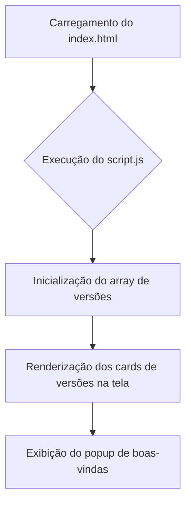
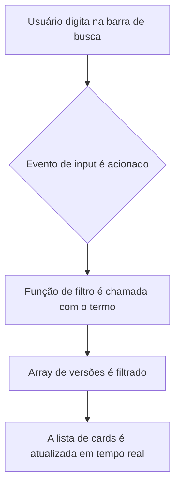
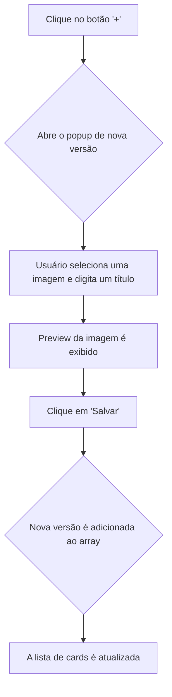

# Documentação Completa do Projeto: Bíblia Sagrada Online

#### Início do projeto: Agosto de 2024

## 1. Visão Geral

Este projeto é uma aplicação web interativa para leitura e estudo da Bíblia Sagrada, desenvolvida com foco em uma experiência de usuário amigável, intuitiva e completa. A aplicação foi construída com **HTML5, CSS3 e JavaScript puro**, sem o uso de frameworks, como um exercício prático para aprofundar e consolidar conhecimentos fundamentais de desenvolvimento web.

O objetivo principal é oferecer uma ferramenta online robusta e acessível, que vai além da simples leitura, incorporando um ecossistema de recursos complementares para estudo e adoração, como a Harpa Cristã, o Cantor Cristão (Hinário Batista), um Dicionário Bíblico e uma Concordância Bíblica completa.

## 2. Estrutura do Projeto

A estrutura de pastas foi organizada para garantir modularidade, escalabilidade e facilitar a manutenção:

```
bibliav1/
├── index.html              # Página inicial da aplicação
├── style.css               # Folha de estilo principal
├── script.js               # Script principal com a lógica geral
├── readme.md               # Documentação geral do projeto
├── projeto.md              # Documentação detalhada do projeto (este arquivo)
├── html/                   # Páginas HTML para as diferentes seções (versões, cursos, etc.)
├── css/                    # Arquivos CSS específicos para cada seção
├── script/                 # Scripts JavaScript modulares e específicos de cada funcionalidade
├── ver/                    # Arquivos de documentação e versionamento do projeto
├── concordancia/           # Dados da Concordância Bíblica, organizados por letra (JSON)
├── dicionario/             # Dados do Dicionário Bíblico, organizados por letra (JSON)
├── harpacrista/            # Hinos da Harpa Cristã (JSON)
├── cantorcristao/          # Hinos do Cantor Cristão (JSON)
├── versao/                 # Dados das diferentes versões da Bíblia, com estrutura hierárquica (versao/livro/capitulo.json)
├── baixar/                 # Arquivos PDF de Bíblias e materiais de estudo para download
└── img/                    # Imagens, ícones e outros recursos visuais
```

## 3. Componentes e Funcionalidades

### Interface Principal
- **Página de Entrada (`index.html`)**: Apresenta as versões da Bíblia em formato de cards interativos.
- **Busca de Versões**: Uma barra de pesquisa que filtra as versões em tempo real.
- **Pop-ups**: Janelas modais para boas-vindas e para adicionar novas versões da Bíblia (funcionalidade de upload de imagem e título).
- **Design Responsivo**: A interface se adapta a diferentes tamanhos de tela, de dispositivos móveis a desktops.

### Módulo de Leitura da Bíblia
- **Navegação Intuitiva**: Um menu lateral permite a seleção de livros, e a área de conteúdo exibe os capítulos e versículos de forma dinâmica.
- **Múltiplas Versões**: Suporte para diversas traduções, carregadas a partir de arquivos JSON.
- **Modo Leitura**: Uma visão otimizada para leitura contínua, com navegação fluida entre capítulos.

### Ferramentas de Estudo
- **Dicionário Bíblico**: Permite a busca por termos bíblicos, com as definições e referências carregadas sob demanda.
- **Concordância Bíblica**: Uma ferramenta poderosa para encontrar todas as ocorrências de uma palavra ou frase, com filtros por Testamento e livro.

### Modo Slide (Datashow)
- **Projeção em Tela Cheia**: Abre uma janela otimizada para apresentações, exibindo versículos com alta legibilidade.
- **Controles Simplificados**: Navegação fácil entre versículos (anterior/próximo), ideal para uso em cultos e estudos em grupo.

### Outros Recursos
- **Downloads**: Seção com links para baixar Bíblias e outros materiais em PDF.
- **Cursos e Utilitários**: Links para recursos externos que complementam o estudo bíblico.

## 4. Fluxo de Dados e Lógica

### Carregamento Inicial da Página


### Busca por uma Versão da Bíblia


### Adição de uma Nova Versão


## 5. Padrões de Código

O projeto adota padrões rigorosos de codificação para garantir a legibilidade, manutenção e escalabilidade do código.

### HTML (`index.html` e outras páginas)
- **Estrutura Semântica**: Uso de tags como `<header>`, `<footer>`, `<main>`, `<section>` e `<aside>`. 
- **Comentários**: Blocos de comentários (`<!---- ... ---->`) são usados para delimitar seções importantes, facilitando a leitura do código.

### CSS (`style.css` e outros)
- **Organização**: As folhas de estilo são divididas em seções lógicas (Reset, Header, Popups, etc.), delimitadas por comentários de bloco.
- **Nomenclatura**: Classes e IDs seguem um padrão descritivo em português.
- **Comentários**: 
    - Blocos de seção: `/*==================== NOME DA SEÇÃO ====================*/`
    - Comentários de linha: Alinhados à direita, explicando propriedades específicas.

### JavaScript (`script.js` e módulos)
- **Modularização**: A lógica é dividida em múltiplos arquivos na pasta `/script/`, cada um com uma responsabilidade clara (ex: `dicionario.js`, `concordancia.js`, `versoes_navegacao.js`).
- **Padrão de Comentários**:
    - **Cabeçalho de Arquivo**: Um bloco de comentário no topo de cada arquivo descreve seu propósito.
    - **Comentários de Linha**: Alinhados à direita (coluna 86), iniciando com um verbo de ação (ex: `// Define...`, `// Carrega...`, `// Adiciona...`).
- **Nomenclatura**: Variáveis e funções são nomeadas em português para manter a consistência.

## 6. Pontos de Melhoria (Futuro)

- **Busca Avançada**: Implementar filtros mais complexos na busca da concordância e dicionário.
- **Leitura em Áudio**: Adicionar a funcionalidade de ouvir a narração dos capítulos.
- **Marcação de Versículos**: Permitir que os usuários salvem e organizem seus versículos favoritos.
- **Compartilhamento**: Integrar botões para compartilhar versículos em redes sociais e outros aplicativos.
- **API e Banco de Dados**: Em uma versão futura, migrar os dados de arquivos JSON para um banco de dados e expor uma API para consumo.
- **Testes Automatizados**: Implementar uma suíte de testes para garantir a estabilidade do código.

## 7. Licença e Contato

- **Licença**: Este projeto está licenciado sob a **Licença MIT**.
- **Contato**: Para dúvidas, sugestões ou colaborações, entre em contato com Wagner F. Freitas pelo e-mail: `wagnerffreitas1973@gmail.com`.
